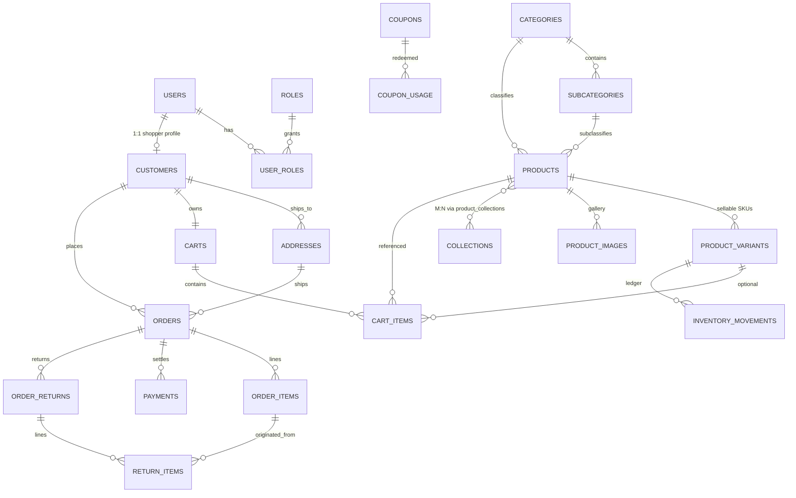

# Vasritha Database Structure (Client Walkthrough)

This document explains the **relational model** used by Vasritha for a DBA review.
Database: PostgreSQL · Schema: `public`

Apply / re-apply integrity upgrades:

```bash
npm run db:optimize
```

Source files:
- Baseline create: [`db/local/schema.sql`](../db/local/schema.sql)
- Integrity upgrade: [`db/local/optimize_v1.sql`](../db/local/optimize_v1.sql)

---

## 1. Domain map (high level)

| Domain | Purpose | Core tables |
|---|---|---|
| Identity & RBAC | Login + permissions | `users`, `roles`, `user_roles` |
| Product Master | What we sell | `categories`, `subcategories`, `products`, `product_variants`, `product_images`, `collections`, `product_collections` |
| Inventory | How much stock exists | `product_variants.stock_quantity`, `inventory_movements` |
| Customer Commerce | Cart / checkout | `customers`, `addresses`, `carts`, `cart_items`, `wishlists`, `wishlist_items` |
| Orders & Finance | Sales lifecycle | `orders`, `order_items`, `payments`, `taxes`, `payment_methods` |
| Promotions & Returns | Discounts / RMA | `coupons`, `coupon_usage`, `order_returns`, `return_items` |
| CMS / Content | Website content | `site_settings`, `menus`, `menu_items`, `banners`, `page_sections`, `section_items`, `website_pages`, `reviews` |
| Audit | Admin history | `audit_logs` |

---

## 2. Entity relationship diagram



---

## 3. Critical design rules (DBA notes)

### 3.1 Product Master vs Inventory (two concepts, one product family)

- **Product Master** = catalog truth (`products` + attributes/images/collections).
- **Inventory** = stock truth.
- Canonical stock lives on **`product_variants.stock_quantity`**.
- `products.stock_quantity` is a **denormalized rollup** (`SUM` of variants), maintained by trigger `trg_variants_sync_product_stock`.
- Why both? Admin product lists need fast stock display; inventory/POS need SKU-level control.

### 3.2 Subcategory integrity

`products.subcategory_id` cannot point to a subcategory from another category.

Enforced with composite FK:

```text
products(category_id, subcategory_id)
  → subcategories(category_id, id)
```

### 3.3 Financial history is protected

- `payments.order_id` → `ON DELETE RESTRICT`
- `inventory_movements.product_variant_id` → `ON DELETE RESTRICT`
- `coupon_usage.coupon_id` → `ON DELETE RESTRICT`
- `order_items` keep snapshot columns (`product_name`, `sku`, `unit_price`, `line_total`) so invoices survive catalog edits.

### 3.4 Customer profile model

`customers.id` **is** `users.id` (shared PK, 1:1).  
A shopper login and customer profile cannot diverge.

### 3.5 Cart / wishlist uniqueness

A cart cannot contain duplicate lines for the same product+variant.

### 3.6 Address default rule

At most **one** `addresses.is_default = true` per customer (partial unique index).

---

## 4. Relationship walkthrough (recommended client path)

1. Start at **`categories` → `subcategories` → `products` → `product_variants`**.
2. Show **`product_images`** and **`product_collections` ↔ `collections`**.
3. Explain stock: update a variant qty → confirm `products.stock_quantity` rollups via trigger.
4. Walk commerce: **`customers` → `addresses` → `carts`/`cart_items` → `orders` → `order_items` → `payments`**.
5. Walk inventory ledger: sale creates **`inventory_movements`** against the variant.
6. Walk returns: **`order_returns` → `return_items` → `order_items`**.
7. Walk RBAC: **`users` → `user_roles` → `roles`**.

---

## 5. Cardinality cheat sheet

| Parent | Child | Cardinality | Delete behavior |
|---|---|---|---|
| `users` | `user_roles` | 1:N | CASCADE |
| `roles` | `user_roles` | 1:N | CASCADE |
| `users` | `customers` | 1:0..1 | CASCADE |
| `categories` | `subcategories` | 1:N | CASCADE |
| `categories` | `products` | 1:N | RESTRICT (default) |
| `products` | `product_variants` | 1:N | CASCADE |
| `products` | `product_images` | 1:N | CASCADE |
| `products` ↔ `collections` | `product_collections` | M:N | CASCADE |
| `customers` | `addresses` | 1:N | CASCADE |
| `customers` | `carts` | 1:1 | CASCADE |
| `carts` | `cart_items` | 1:N | CASCADE |
| `customers` | `orders` | 1:N | RESTRICT |
| `orders` | `order_items` | 1:N | CASCADE |
| `orders` | `payments` | 1:N | RESTRICT |
| `product_variants` | `inventory_movements` | 1:N | RESTRICT |
| `orders` | `order_returns` | 1:N | RESTRICT |
| `order_returns` | `return_items` | 1:N | CASCADE |

---

## 6. Named constraints / indexes to highlight

- `products_compare_at_price_chk` — compare-at cannot be below selling price
- `order_items_line_total_chk` — `line_total = unit_price * quantity`
- `addresses_one_default_per_customer_uidx` — one default address
- `cart_items_cart_product_variant_uidx` — unique cart line
- `products_category_subcategory_fkey` — subcategory belongs to category
- `products_category_status_idx` — common storefront filter
- `inventory_movements_variant_created_idx` — stock history by SKU

---

## 7. Intentionally unused / legacy notes

- `public.app_role` enum exists historically; live `roles.code` is `text` so custom roles are allowed.
- `public.stock_status` enum is reserved for future UI stock badges; on-hand qty remains numeric on variants.
- Typed enums added in optimize v1 (`coupon_status`, `return_status`, `inventory_movement_type`, `channel_type`) are available for progressive column migration without breaking current text/`check` columns.

---

## 8. Verify quickly (SQL)

```sql
-- FK coverage sample
select conrelid::regclass as table, conname, pg_get_constraintdef(oid)
from pg_constraint
where contype = 'f' and connamespace = 'public'::regnamespace
order by 1, 2;

-- Stock rollup sample
select p.name, p.stock_quantity as product_stock,
       coalesce(sum(v.stock_quantity),0) as variant_sum
from products p
left join product_variants v on v.product_id = p.id
group by p.id
having p.stock_quantity <> coalesce(sum(v.stock_quantity),0);
-- Expect 0 rows after optimize.
```
