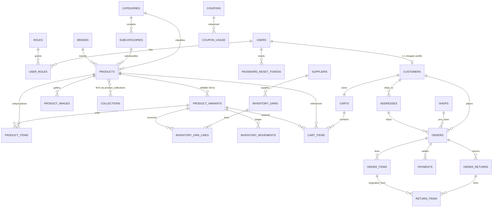

# Vasritha Database Structure (Client Walkthrough)

This document explains the **relational model** used by Vasritha for a DBA review.
Database: PostgreSQL · Schema: `public`

Apply / re-apply integrity upgrades:

```bash
npm run db:optimize
```

**Local speed tip:** after optimize, keep this in `apps/web/.env.local`:

```bash
SKIP_RUNTIME_SCHEMA_ENSURE=true
```

That stops the app from running `ALTER TABLE` / `CREATE TABLE` on every page/API call. Set it to `false` only while inventing new columns before they are in `optimize_v*.sql`.

Source files:
- Baseline create: [`db/local/schema.sql`](../db/local/schema.sql)
- Integrity upgrade v1: [`db/local/optimize_v1.sql`](../db/local/optimize_v1.sql) — FKs, CHECKs, indexes, stock rollup trigger
- Integrity upgrade v2: [`db/local/optimize_v2.sql`](../db/local/optimize_v2.sql) — GRN/suppliers, units, courier, finance, comments, stock repair

---

## 1. Domain map (high level)

| Domain | Purpose | Core tables |
|---|---|---|
| Identity & RBAC | Login + permissions | `users`, `roles`, `user_roles`, `password_reset_tokens` |
| Product Master | What we sell | `categories`, `subcategories`, `products`, `product_variants`, `product_images`, `collections`, `product_collections`, `brands` |
| Unique units | Hang-tag barcodes | `product_items`, `product_price_history` |
| Purchasing | Inbound stock | `suppliers`, `inventory_grns`, `inventory_grn_lines` |
| Inventory ledger | Stock movements | `inventory_movements` |
| Customer Commerce | Cart / checkout | `customers`, `addresses`, `carts`, `cart_items`, `wishlists`, `wishlist_items` |
| Orders & fulfilment | Sales + courier | `orders`, `order_items`, `payments`, `shops` |
| Finance | Cashbook / COA | `finance_payment_entries`, `finance_accounts`, `finance_cash_accounts` |
| Promotions & Returns | Discounts / RMA | `coupons`, `coupon_usage`, `order_returns`, `return_items` |
| CMS / Content | Website content | `site_settings`, `menus`, `menu_items`, `banners`, `page_sections`, `section_items`, `website_pages`, `reviews` |
| Audit | Admin history | `audit_logs` |

---

## 2. Entity relationship diagram


```mermaid
erDiagram
  USERS ||--o{ USER_ROLES : has
  ROLES ||--o{ USER_ROLES : grants
  USERS ||--o| CUSTOMERS : "1:1 shopper profile"
  USERS ||--o{ PASSWORD_RESET_TOKENS : resets

  CATEGORIES ||--o{ SUBCATEGORIES : contains
  CATEGORIES ||--o{ PRODUCTS : classifies
  SUBCATEGORIES ||--o{ PRODUCTS : subclassifies
  BRANDS ||--o{ PRODUCTS : brands
  PRODUCTS ||--o{ PRODUCT_VARIANTS : "sellable SKUs"
  PRODUCTS ||--o{ PRODUCT_IMAGES : gallery
  PRODUCTS ||--o{ PRODUCT_ITEMS : "unique pieces"
  PRODUCT_VARIANTS ||--o{ PRODUCT_ITEMS : units
  PRODUCTS }o--o{ COLLECTIONS : "M:N via product_collections"

  SUPPLIERS ||--o{ INVENTORY_GRNS : supplies
  INVENTORY_GRNS ||--o{ INVENTORY_GRN_LINES : lines
  PRODUCT_VARIANTS ||--o{ INVENTORY_GRN_LINES : received
  PRODUCT_VARIANTS ||--o{ INVENTORY_MOVEMENTS : ledger

  CUSTOMERS ||--o{ ADDRESSES : ships_to
  CUSTOMERS ||--|| CARTS : owns
  CARTS ||--o{ CART_ITEMS : contains
  PRODUCTS ||--o{ CART_ITEMS : referenced
  PRODUCT_VARIANTS ||--o{ CART_ITEMS : optional

  CUSTOMERS ||--o{ ORDERS : places
  SHOPS ||--o{ ORDERS : pos_store
  ORDERS ||--o{ ORDER_ITEMS : lines
  ORDERS ||--o{ PAYMENTS : settles
  ADDRESSES ||--o{ ORDERS : ships

  COUPONS ||--o{ COUPON_USAGE : redeemed
  ORDERS ||--o{ ORDER_RETURNS : returns
  ORDER_RETURNS ||--o{ RETURN_ITEMS : lines
  ORDER_ITEMS ||--o{ RETURN_ITEMS : originated_from
```

---

## 3. Critical design rules (DBA notes)

### 3.1 Why three stock levels?

| Layer | Table / column | Role |
|---|---|---|
| Piece | `product_items` | One physical hang-tag. Status `to_sell` = available. |
| SKU | `product_variants.stock_quantity` | Aggregate for cart/POS. Synced from `to_sell` items when units exist. |
| Catalog | `products.stock_quantity` | Denormalized `SUM(variants)` via trigger `trg_variants_sync_product_stock`. |

**Why not only one column?** Unique-piece retail needs barcode-level tracking; listings need a cheap rollup; variants need size-level sellable qty.

### 3.2 Subcategory integrity

`products.subcategory_id` cannot point to a subcategory from another category.

Enforced with composite FK:

```text
products(category_id, subcategory_id)
  → subcategories(category_id, id)
```

### 3.3 GRN approval gate (why not update stock on insert?)

- Staff submit `inventory_grns` as `pending_approval`.
- Manager approve creates `product_items` + `inventory_movements` once.
- Prevents accidental double-stocking and keeps a clear audit trail.
- `bill_no` is unique per supplier while status is pending/approved (duplicate bill protection).

### 3.4 Why courier fields live on `orders`?

Today each online order ships as **one parcel**. AWB/courier name/note are shipment metadata of the order header.

If multi-parcel shipping is required later, introduce `shipments` / `shipment_parcels` and migrate these three columns.

### 3.5 Why `password_reset_tokens.token_hash`?

Local auth (not Supabase Auth). The email link carries a raw token; the DB stores **SHA-256(token)** only so a DB dump cannot reuse reset links.

### 3.6 Financial history is protected

- `payments.order_id` → `ON DELETE RESTRICT`
- `inventory_movements.product_variant_id` → `ON DELETE RESTRICT`
- `coupon_usage.coupon_id` → `ON DELETE RESTRICT`
- `order_items` keep snapshot columns (`product_name`, `sku`, `unit_price`, `line_total`) so invoices survive catalog edits.

### 3.7 Customer profile model

`customers.id` **is** `users.id` (shared PK, 1:1).  
A shopper login and customer profile cannot diverge.

### 3.8 GST / HSN constraints

- `products.gst_rate` CHECK IN `(0, 3, 5, 9, 18)` — India slab whitelist used by the UI.
- `products.hsn_code` CHECK `^[0-9]{4,8}$` when present.

### 3.9 Coming soon (`restock_expected`)

Boolean on `products`, not a separate status enum value, so approval lifecycle (`draft` / `pending_approval` / `active` / …) stays orthogonal to merchandising visibility.

---

## 4. Relationship walkthrough (recommended client path)

1. Start at **`categories` → `subcategories` → `products` → `product_variants` → `product_items`**.
2. Show **`product_images`** (`website` vs `internal`) and **`brands`**.
3. Explain stock: units `to_sell` → variant qty → product rollup trigger.
4. Walk purchasing: **`suppliers` → `inventory_grns` → approve → movements + units**.
5. Walk commerce: **`customers` → `addresses` → `carts` → `orders` → `order_items` → `payments`**.
6. Show courier columns on **`orders`** (AWB for label + account tracking).
7. Walk RBAC: **`users` → `user_roles` → `roles`**.

---

## 5. Cardinality cheat sheet

| Parent | Child | Cardinality | Delete behavior |
|---|---|---|---|
| `users` | `user_roles` | 1:N | CASCADE |
| `roles` | `user_roles` | 1:N | CASCADE |
| `users` | `customers` | 1:0..1 | CASCADE |
| `users` | `password_reset_tokens` | 1:N | CASCADE |
| `categories` | `subcategories` | 1:N | CASCADE |
| `categories` | `products` | 1:N | RESTRICT (default) |
| `products` | `product_variants` | 1:N | CASCADE |
| `products` | `product_items` | 1:N | CASCADE |
| `products` | `product_images` | 1:N | CASCADE |
| `suppliers` | `inventory_grns` | 1:N | RESTRICT (nullable FK) |
| `inventory_grns` | `inventory_grn_lines` | 1:N | CASCADE |
| `customers` | `orders` | 1:N | RESTRICT |
| `orders` | `order_items` | 1:N | CASCADE |
| `orders` | `payments` | 1:N | RESTRICT |
| `product_variants` | `inventory_movements` | 1:N | RESTRICT |

---

## 6. Named constraints / indexes to highlight

- `products_compare_at_price_chk` — compare-at cannot be below selling price
- `products_gst_rate_chk` — GST slab whitelist
- `order_items_line_total_chk` — `line_total = unit_price * quantity`
- `addresses_one_default_per_customer_uidx` — one default address
- `cart_items_cart_product_variant_uidx` — unique cart line
- `products_category_subcategory_fkey` — subcategory belongs to category
- `inventory_grns_supplier_bill_active_uidx` — no duplicate supplier bills
- `inventory_movements_variant_created_idx` — stock history by SKU
- `orders_courier_awb_idx` — tracking lookup

---

## 7. Intentionally unused / legacy notes

- `public.app_role` enum exists historically; live `roles.code` is `text` so custom roles are allowed.
- `public.stock_status` enum is reserved for future UI stock badges; on-hand qty remains numeric on variants/items.
- Typed enums in optimize v1 (`coupon_status`, `return_status`, `inventory_movement_type`, `channel_type`) are available for progressive column migration without breaking current text/`check` columns.
- Runtime `ensure*Schema()` helpers in the app are a safety net for hosted DBs; **source of truth for review is `schema.sql` + `optimize_v*.sql`**.
- With `SKIP_RUNTIME_SCHEMA_ENSURE=true` (recommended locally after optimize), those helpers no-op so storefront/admin stay fast.

---

## 8. Verify quickly (SQL)

```sql
-- Missing comments (expect few / none after optimize_v2)
select c.relname
from pg_class c
join pg_namespace n on n.oid = c.relnamespace
where n.nspname = 'public' and c.relkind = 'r'
  and obj_description(c.oid, 'pg_class') is null
order by 1;

-- Stock rollup must match
select p.name, p.stock_quantity as product_stock,
       coalesce(sum(v.stock_quantity),0) as variant_sum
from products p
left join product_variants v on v.product_id = p.id
group by p.id
having p.stock_quantity <> coalesce(sum(v.stock_quantity),0);
-- Expect 0 rows after optimize.

-- Purchase domain present
select to_regclass('public.suppliers'),
       to_regclass('public.inventory_grns'),
       to_regclass('public.inventory_grn_lines');
```
